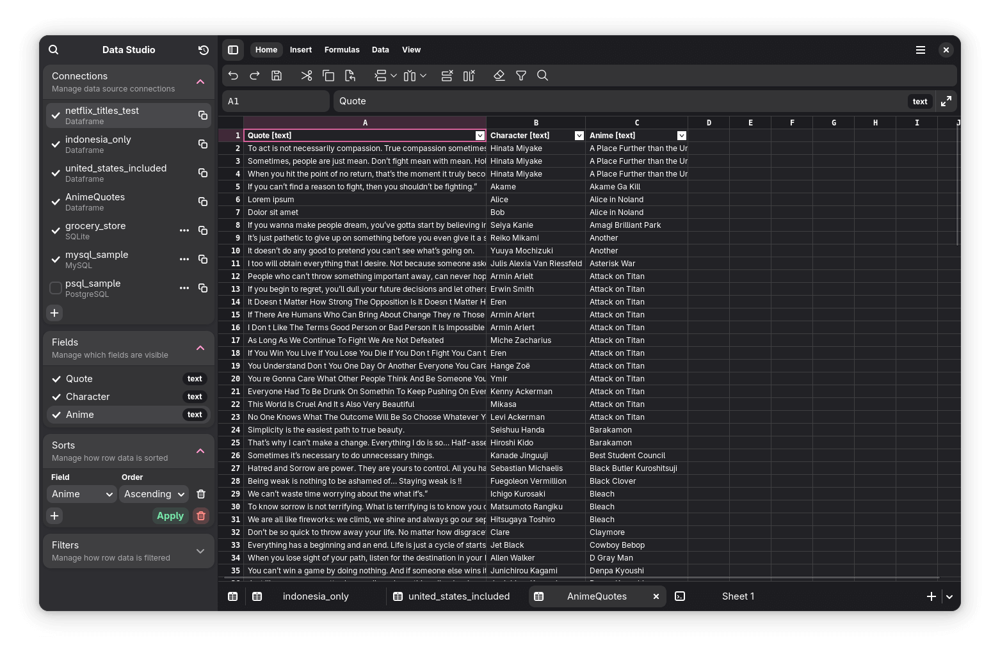

# Eruo Data Studio

A powerful yet friendly ETL (Extract, Transform, Load) tool powered by [Polars](https://pola.rs/) backend, targeting the large data science community using Python.



<!-- TODO: describe the project more accurately -->

<!-- TODO: list all features in the software -->

<!-- TODO: add background/motivation section -->

## Limitations

Currently we only support x86_64 architectures and Linux distributions using `glibc` (GNU C Library) due to lack of dependecy management by the team. Building [Polars](https://pola.rs/) from source doesn't seem to be so complicated though, so we'll make sure to try again in the near future.

Since we started developing the proof-of-concept with Libadwaita, a building blocks for GNOME applications, so it's supposed to be compatible only with GNOME desktop environment. I think it's possible that the application will still look correct and good on other distributions. Anyway, we'll add support for Windows in the future and hopefully for macOS as well.

## Contributing

The recommended way to build and run this project is using [GNOME Builder](https://apps.gnome.org/Builder/).

I personally use [Visual Studio Code](https://code.visualstudio.com/), but you can use whatever your favorite is. To run and build using Flatpak on VS Code, consider installing [Flatpak](https://marketplace.visualstudio.com/items?itemName=bilelmoussaoui.flatpak-vscode) extension. Run the following commands in the terminal to install the dependencies (on Fedora):

```sh
sudo dnf install flatpak flatpak-builder --assumeyes
flatpak remote-add --if-not-exists gnome-nightly https://nightly.gnome.org/gnome-nightly.flatpakrepo
flatpak install gnome-nightly org.gnome.Platform//master
flatpak install gnome-nightly org.gnome.Sdk//master
```

Type and run `Flatpak: Select or Change Active Manifest` in the command palette (<kbd>F1</kbd> or <kbd>Ctrl</kbd>+<kbd>Shift</kbd>+<kbd>P</kbd>) and select the `com.macipra.Eruo.Devel.json` manifest file. Finally, type and run `Flatpak: Build and Run` in the command palette or simply hit <kbd>Ctrl</kbd>+<kbd>Alt</kbd>+<kbd>B</kbd>.

If you're using a Python language server, you may want to install the requirements. For better dependency management, it's recommended to create a virtual environment rather than installing packages globally:

```sh
python -m venv .pyenv
source .pyenv/bin/activate
pip install -r requirements-devel.txt
```

To add new dependencies using [`pip`](https://packaging.python.org/en/latest/key_projects/#pip) to the [`flatpak-builder`](https://docs.flatpak.org/en/latest/flatpak-builder.html) manifest json file, you can use the [`flatpak-pip-generator`](https://github.com/flatpak/flatpak-builder-tools/tree/master/pip). Either adding the reference to the `com.macipra.Eruo*.json` files or copy-pasting the content directly into the manifest files and delete the generated file. Do not forget to update the `requirements*.txt` files as well.

<!-- TODO: add instructions on packaging -->

Here are some useful references for the project development:

- Flatpak: https://docs.flatpak.org/en/latest/index.html
- Flathub: https://docs.flathub.org/docs/category/for-app-authors
- GNOME developer: https://developer.gnome.org/documentation/index.html
- GNOME Python API: https://api.pygobject.gnome.org/index.html
- GTK4: https://docs.gtk.org/gtk4/index.html
- PyGObject: https://gnome.pages.gitlab.gnome.org/pygobject/index.html
- Pycairo: https://pycairo.readthedocs.io/en/latest/index.html
- Libadwaita: https://gnome.pages.gitlab.gnome.org/libadwaita/doc/1.4/index.html
- Polars: https://docs.pola.rs/api/python/stable/reference/index.html

Please bear with me, most of the docstrings are AI-generated, though sometimes under my supervision. Your help will be greatly appreciated.

## Licenses

This project is distributed under the [GNU General Public License Version 3](https://www.gnu.org/licenses/gpl-3.0.en.html). We use GTK and [Libadwaita](https://gitlab.gnome.org/GNOME/libadwaita) to build the user interface, which are licensed under the [GNU Lesser General Public License Version 2.1](https://www.gnu.org/licenses/lgpl-2.1.en.html). The backend for data manipulation uses [Polars](https://pola.rs/), which is distributed under the [MIT License](https://opensource.org/license/mit). For other dependencies, see the `requirements.txt` file.

<!-- TODO: list all softwares and related publications which are being studied during the development -->